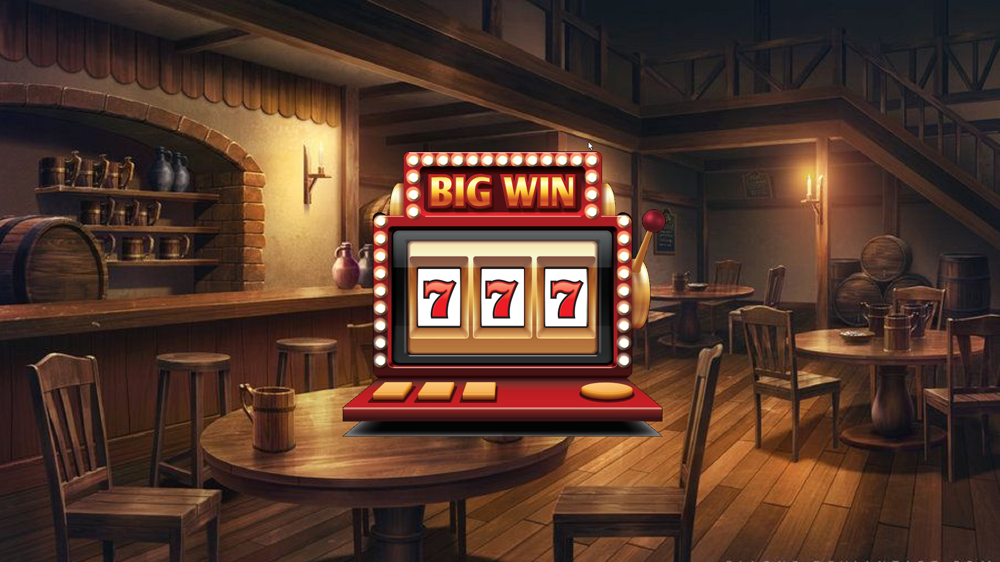
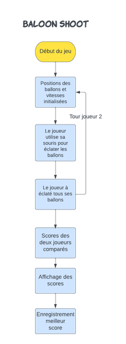
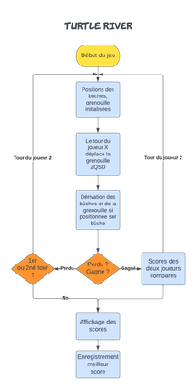
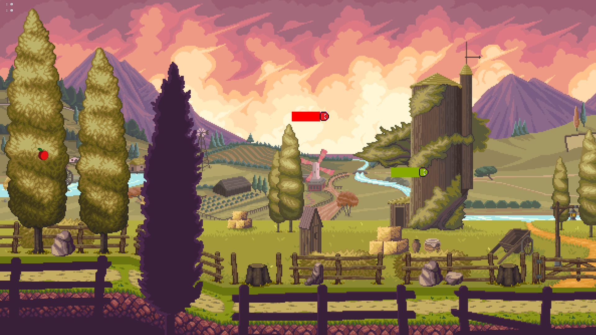
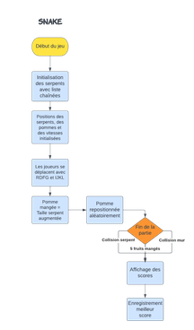
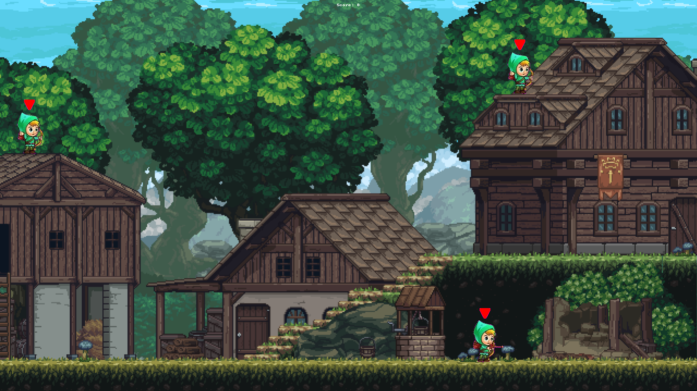
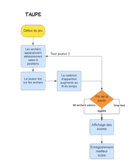
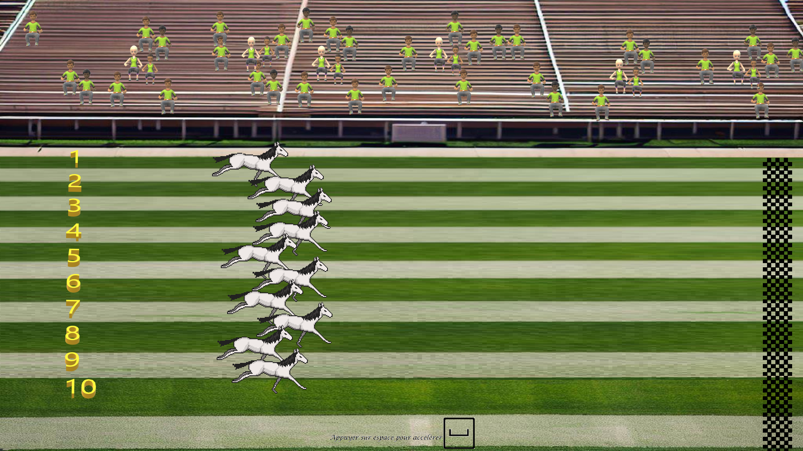

<script type="module">
  import mermaid from 'https://cdn.jsdelivr.net/npm/mermaid@10/dist/mermaid.esm.min.mjs';
    mermaid.initialize({ 
        startOnLoad: true,
        theme: 'base',
    });
</script>

<!--
# Style lead only for this slide
_class: lead
_footer: Algorithmique Avancée et Bibliothèque Graphique - 2022-2023
-->


**ING1** Projet d'informatique


# ECE World

Nous avons aujourd'hui le plaisir de vous présenter notre tout nouveau party-game réalisé aux couleurs de l'ECE sur le thème du Moyen-âge ! 

En vous souhaitant un bon jeu ! :)

- L'équipe RLBL.

---

# L'équipe :


            Lola LE GALL        |        Baptiste CHESNOT          |                 Robin QUERIAUX                 |            Laouïg ELEOUET
---


---

## Thème : Le Royaume de l'ECE

Nous avons décidé de choisir pour thème le Moyen-Âge et plus particulièrement les chevaliers. Notre carte est dans un style fantasy avec un choix de plusieurs personnage en accord avec celle-ci.

Ils y a de plus des petites références à des jeux que nous affectionons particulièrement en rapport avec ce thème.
Tous nos jeux ont soit un scénario soit des éléments graphiques appartenant à ce thème pour offrir au joueur une expérience la plus immersive qu'il soit !

---

# Carte `1/2`

*Réalisée par : **Baptiste**, **Robin**.*

Décrire ici les fonctionnalités implémentées : choix joueurs, saisie des noms, affichage des scores/classement... Comment avez-vous fait ? Quels étaient les problèmes rencontrés.
- Choix des joueurs et du nom : Après avoir cliquer sur le bouton pour commencer la partie, chaque joueur se verra, chacun à son tour, choisir un personnage et le nom de son chevalier par une fenêtre pop-up.


- Accès aux mini-jeux et fonctionnalités (sortie du parc, tableau des scores) : Dans le parc, chaque mini-jeu est représenté par un bâtiment personalisé permettant de bien distinguer chaque mini-jeu. Le joueur a la possibilité de marcher ou bien de courir pour accéder plus rapidement à ses jeux préférés !
 De plus, le joueur peut, à tout moment sortir du parc par la porte ou bien consulter le tableau des meilleurs scores.


---

# Carte `2/2`

- Sauvegarde et charge de la partie : //TODO

- Affichage des tickets et des pseudos : //TODO
---

# Organisation des jeux

- Les jeux sont classés de façon méthodique dans le Git avec un fichier pour chaque jeu, où fonctionnalité (Gestion des joueurs, musiques ou parc).


- Chaque dossier de jeu a son propre répertoire d'image afin de ne pas les mélanger pour tous les jeux et avoir une meilleur visibilité.


- L'appel d'un mini-jeu ne se fait qu'une fois, le système de tour étant directement implementé dans le code. Ainsi chaque jeu ne prend aucun paramètre (on écrira par exemple : river(),snake()...)


- On va pouvoir accéder aux jeux en y aller physiquement sur la carte à l'aide du personnage mis à disposition.


- A la fin de chaque partie de mini-jeu, on appuie sur le bouton indiqué à l'écran afin de revenir dans le parc après l'affichage des scores et de choisir un nouveau mini-jeu.


- De plus la liste de meilleur score est mis à jour après l'affichage des scores par l'appel de la fonction loadhighscore().
---


# Ducky

*Réalisé par : **Lola** (100%).*


    La pêche aux canard fonctionne de la manière suivante :
        - chaque canard est représenté par une structure qui contient 4 entiers ( des coordonnées x, y et des vecteurs de déplacement x, y )
          ces coordonnées sont chargées aléatoirement au début de chaque partie.

        - On remplit un tableau de structure de 45 canards et l’on dessine les 45 images de canard aux coordonnées associées
          un autre sous-programme va aussi venir vérifier si les canards on des tous les coordonnées différentes. 
          si ce n’est pas le cas, si les canards se touchent, il y a collision.

        - en cas de collision, on change aléatoirement le vecteur, déplacement, ordonnée et abscisse une nouvelle fois.

        - On charge aussi la position de la souris et un sous programme compare ses coordonnées à celle de tous les canards.


Les parties du joueur 1 et du joueur 2 sont des sous programme différent qui prennent en paramètres un pointeur d’entier un pointeur : le score.

Dans la boucle de jeux on détecte le clic gauche de la souris et ses coordonnées sur l’écran, si les coordonnées correspondent avec un des canards, celui-ci vient se placer dans un des deux paniers et le score augmente. 

Une fois que les deux joueurs ont joué, on compare les scores et on annonce le gagnant.

---
# Jackpot
*Réalisé par : **Lola** (100%).*



    Le jeu du casino fonctionne de la manière suivante : 
        - on commence par charger les quatre icônes de 0 a 3.
        - Quand l’utilisateur appui sur entrer 3 icône sont tirés aléatoirement pour chaque roue de la machine si les trois icônes ont le même numéro on ajoute 1 au score. 
        - Au bout de 5 appuie sur entrer c’est au tour de l’adversaire on compare ensuite les scores et on annonce le gagnant.
---
# Shoot Baloon
*Réalisé par : **Laouïg** (100%).*


    Le déroulement du jeu de tir au ballon est le suivant :

        - Les règles sont énoncées, les joueurs se préparent au jeu (-1 ticket pour les deux joueurs).
        - Ensuite, chacun leur tour, les joueurs doivent éclater les ballons, 
          rebondissant sur les murs à haute vitesse le plus vite possible !
        - Finalement, le score des deux joueurs s'affiche et le meilleur est gratifié de 2 tickets !
        - Le meilleur score est enregistré s'il y a lieu, puis mis à jour.
Gestion du déplacement des ballons et condition de victoire :

- Premièrement chaque ballon est initialisé à une position et vitesse aléatoire dans les limites de l'écran et son état mis à 0 (non éclaté) :
```C
int baloonxy[2[5]; //Positions des 5 ballons en x et y
int vx[5],vy[5]; //Vitesses des 5 ballons en x et en y
int baloonstate[5]; //tableau enregistrant l'état des 5 ballons (0=non-éclaté ; 1=éclaté)
```
- A chaque tour de boucle une condition vérifie si chaque ballon touche le borde de l'écran et si tel est le cas, sa vitesse est inversée pour donner un effet de rebond
```C
  if ((baloonxy[0][i] < 0 && vx[i] < 0) || (baloonxy[0][i] + baloon_w > SCREEN_W && vx[i] > 0)) {
vx[i] = -vx[i];
}
if ((baloonxy[1][i] < 0 && vy[i] < 0) || (baloonxy[1][i] + baloon_h > SCREEN_H && vy[i] > 0)) {
vy[i] = -vy[i];
}
//Conditions gérant le rebond des ballons
```
- Pour savoir quand tous les ballons sont éclatés, une variable end est incrémentée à chaque fois qu'un baloonState[x] passe à 1.
```C
  if ((mouse_b & 1) && (mouse_x > baloonxy[0][i]) && (mouse_x < (baloonxy[0][i] + baloon_w)) &&
(mouse_y > baloonxy[1][i]) && (mouse_y < (baloonxy[1][i] + baloon_w))) {
baloonState[i] = 1;
baloonxy[0][i] = -1000; // Positions misent hors de l'écran pour que le ballon ne soit pas éclaté plusieurs fois par le joueur
baloonxy[1][i] = -1000;
end++;
}
//Conditions de vérification pour le ballon éclaté
```

---
# Rivière de la Tortue
*Réalisé par : **Laouïg** (100%).*

---

    Pour ce qui est du jeu de la rivière :

        - Les règles sont énoncées, les joueurs se préparent au jeu (-1 ticket pour les deux joueurs).
        - Ensuite, les bûches vont être générées aléatoirement avec différentes tailles et dériver de gauche à droite ou inversement.
        - Les joueurs prennent le contrôle d'une grenouille, devant frayer son chemin à l'autre bout de la rivière le plus vite possible.
        - Chaque fois qu'une bûche sort de l'écran sa réapparition est aléatoire dans le temps.
        - Finalement, le score des deux joueurs s'affiche et le meilleur est gratifié de 2 tickets !
        - Le meilleur score est enregistré s'il y a lieu, puis mis à jour.

Fonctionnement et gestion des bûches:

- La postition de chaque bûche est déclarée puis initialisée dans un tableau à 2 dimensions :
```C
int log[2][8]; // [0][x] pos en abscisse de la bûche x,[1][x] pos en ordonnée de la bûche x
```
- Un tableau va ensuite se charger de gérer l'apparition aléatoire dans le temps et la taille aléatoire de chaque bûche :
```C
int randtime[8]; // On initialise à rand()%10000 et la bûche x apparait si randtime[x]<40
int randbmp[8]; // Initialisé à rand()%1 avant la boucle de jeu (0 = moyen, 1=grande)
```
- Pour ce qui est de la dérivation de la grenouille se trouvant sur une bûche, la position de la grenouille sur la bûche x est enregistrée en fonction de son ordonnée, on va vérifier qu'elle se trouve bien sur une bûche et la faire dériver, soit à droite, soit à gauche.
```C
int logfrog; // Prend une valeur de 1 à 8 selon la bûche où se trouve la grenouille
int dlog; //Vitesse des bûches, soustraite ou ajoutée à la position en x de la grenouille si présente sur la bûche
```
- Gestion des collisions d'élimination rivière : Le seul moyen que j'ai trouvé pour que les collisions soient fonctionnelles est de sacrifier l'esthétisme du jeu en rajoutant des rectangles marron en dessous de chaque BMP de bûche. A l'aide de la fonction getPixel() on peut vérifier la couleur du pixel sur lequel se trouve la grenouille en un point et éliminer le joueur. 
```C
if (frogy+frogw<700 && frogy>100 && !(pixelR == couleurRm && pixelG == couleurGm && pixelB == couleurBm)&& !((frogx + frogw / 2) > log[0][logfrog] && (frogx + frogw / 2) < log[0][logfrog] + logw[logfrog] &&
(frogy + frogw) > log[1][logfrog] && (frogy + frogw) < log[1][logfrog] + 124))
    //Condition d'élimination du joueur où l'on a pixelX, la couleur analysée et pixelXm la couleur de référence
```



---
# Snake
*Réalisé par : **Robin** (100%).*



        Pour ce qui est du snake :
        - blablabla


---
# Tape Taupe
*Réalisé par : **Robin** (100%).*



    Pour ce qui est du snake :
        - blablabla

---
# Héros de la guitare
*Réalisé par : **Baptiste** (100%).*


    Pour ce qui est du Guitar Hero :
        - blablabla

---
# Course de chevaux
*Réalisé par : **Baptiste** (100%).*



    Pour ce qui est du snake :
        - blablabla

# Bilan collectif
`Comment le travail a-t-il été réparti et qui s'est occupé de quelle fonctionnalité ?`
---
---
# Robin


- `✅ 100%` Snake
- `✅ 100%` Tape-Taupe
- `✅ 100%` Système de gestion de point (structure)
- `✅ 100%` Système de sauvegarde du jeu en cours


---

# Laouïg

- `✅ 100%` Traversée de la rivière
  - *L'ésthestime global du jeu à été sacrifié en partie pour conserverun gameplay plaisant (affichage bûche)*
- `✅ 100%` Tir aux ballons
- `✅ 100%` MARP : Mise en page, graphes d'appel et présentation générale
---

# Lola

- `✅ 100%` Pêche aux canards
- `✅ 100%` Jackpot
- `✅ 100%` Infographie et affiche du jeu

---
# Baptiste


- `✅ 100%` Course de chevaux
- `✅ 100%` Héros de la guitare
- `✅ 100%` Création et gestion du parc
---
# Investissement

Dans notre second et dernier projet d'informatique de cette première année d'ingénieur, le travail a été assez bien répartie pour ce qui est des jeux (chacun d'entre nous en a réalisé 2).
Cependant pour ce qui est de la partie parc et gestion global,Robin et Baptiste y on passé le plus de temps. Cela pris en compte nous attribuerons donc aux membres du groupe les notes sur 20 de :
- `Lola` : 18/20
- `Baptiste` : 20/20
- `Robin` : 19/20
- `Laouïg` : 18/20
---

# Récapitulatif des jeux

| Jeu                 | Avancement | Problèmes / reste                     |
|---------------------|------------|---------------------------------------|
| Jackpot             | 100%       | -                                     |
| Pêche aux canards   | 100%       | -                                     |
| Traversée rivière   | 100%       | Amélioration de l'esthétisme possible |
| Tir aux ballons     | 100%       | -                                     |
| Héros de la guitare | 100%       | -                                     |
| Course de chevaux   | 100%       | -                                     |
| Snake               | 100%       | -                                     |
| Tape-Taupes         | 100%       | -                                     |


---

# Contribution Github


---


# Schémas et Graphes

Vous pouvez utiliser [Mermaid.js](https://mermaid.js.org/) pour générer des schémas. Regardez la documentation.


# Emojis

https://gist.github.com/rxaviers/7360908


# Export PDF

Depuis récemment, l'export (**`Export Slide Deck...`**) en PDF oublie parfois des éléments. 
Si c'est le cas, nous vous conseillons d'exporter en fichier PowerPoint (pptx), puis de l'exporter en PDF depuis PowerPoint.