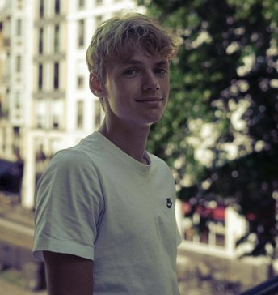
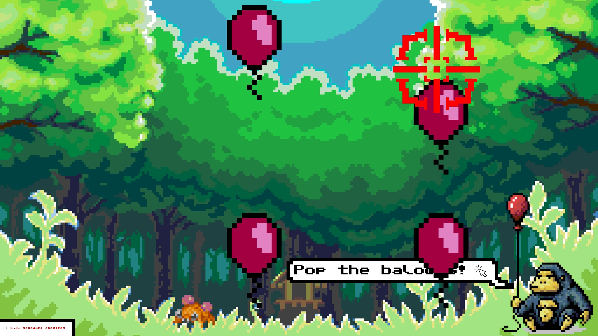

<script type="module">
  import mermaid from 'https://cdn.jsdelivr.net/npm/mermaid@10/dist/mermaid.esm.min.mjs';
    mermaid.initialize({ 
        startOnLoad: true,
        theme: 'base',
    });
</script>

<!--
# Style lead only for this slide
_class: lead
_footer: Algorithmique Avancée et Bibliothèque Graphique - 2022-2023
-->


**ING1** Projet d'informatique


# ECE World

Nous avons aujourd'hui le plaisir de vous présenter notre tout nouveau party-game réalisé aux couleurs de l'ECE sur le thème du Moyen-âge ! 

En vous souhaitant un bon jeu ! :)

- L'équipe RLBL.

---

# L'équipe :





            Lola LE GALL        |        Baptiste CHESNOT          |                 Robin QUERIAUX                 |            Laouïg ELEOUET
---


---

## Thème : Le Royaume de l'ECE

Nous avons décidé de choisir pour thème le Moyen-Âge et plus particulièrement les chevaliers. Notre carte est dans un style fantasy avec un choix de plusieurs personnage en accord avec celle-ci.

Ils y a de plus des petites références à des jeux que nous affectionons particulièrement en rapport avec ce thème.
Tous nos jeux ont soit un scénario soit des éléments graphiques appartenant à ce thème pour offrir au joueur une expérience la plus immersive qu'il soit !

---

# Carte `1/2`

*Réalisée par : **Baptiste**, **Robin**.*

Décrire ici les fonctionnalités implémentées : choix joueurs, saisie des noms, affichage des scores/classement... Comment avez-vous fait ? Quels étaient les problèmes rencontrés.
- Choix des joueurs et du nom : Après avoir cliquer sur le bouton pour commencer la partie, chaque joueur se verra, chacun à son tour, choisir un personnage et le nom de son chevalier par une fenêtre pop-up.


- Accès aux mini-jeux et fonctionnalités (sortie du parc, tableau des scores) : Dans le parc, chaque mini-jeu est représenté par un bâtiment personalisé permettant de bien distinguer chaque mini-jeu. Le joueur a la possibilité de marcher ou bien de courir pour accéder plus rapidement à ses jeux préférés !
 De plus, le joueur peut, à tout moment sortir du parc par la porte ou bien consulter le tableau des meilleurs scores.


---

# Carte `2/2`

- Sauvegarde et charge de la partie : //TODO

- Affichage des tickets et des pseudos : //TODO
---

# Organisation des jeux

- Les jeux sont classés de façon méthodique dans le Git avec un fichier pour chaque jeu, où fonctionnalité (Gestion des joueurs, musiques ou parc).


- Chaque dossier de jeu a son propre répertoire d'image afin de ne pas les mélanger pour tous les jeux et avoir une meilleur visibilité.


- L'appel d'un mini-jeu ne se fait qu'une fois, le système de tour étant directement implementé dans le code. Ainsi chaque jeu ne prend aucun paramètre (on écrira par exemple : river(),snake()...)


- On va pouvoir accéder aux jeux en y aller physiquement sur la carte à l'aide du personnage mis à disposition.


- A la fin de chaque partie de mini-jeu, on appuie sur le bouton indiqué à l'écran afin de revenir dans le parc après l'affichage des scores et de choisir un nouveau mini-jeu.


- De plus la liste de meilleur score est mis à jour après l'affichage des scores par l'appel de la fonction loadhighscore().
---


# Ducky

*Réalisé par : **Lola** (100%).*


Décrire le fonctionnement du jeu dans les grandes lignes. Comment vous l'avez conçu.
- Les canards vont de la droite à la gauche.
- Lorsqu'ils ont disparu, ils ont 1 chance sur 50 de réapparaitre à droite.
- Les canards vont à une vitesse différente (tirée aléatoirement).
- La collision des canards est détectée.
- etc.
Pour chaque jeu (bien détailler au moins un jeu par personne), précisez les structures de données (structures importantes, tableaux importants, listes chainées...) et les fonctions importantes (avec leur prototype).

### Tableaux

- `Canard canards[20]`
### Graphe d'appel
---
---
# Jackpot
*Réalisé par : **Lola** (100%).*


---
---
# Shoot Baloon
*Réalisé par : **Laouïg** (100%).*



    Le déroulement du jeu de tir au ballon est le suivant :

        - Les règles sont énoncées, les joueurs se préparent au jeu (-1 ticket pour les deux joueurs).
        - Ensuite, chacun leur tour, les joueurs doivent éclater les ballons, 
          rebondissant sur les murs à haute vitesse le plus vite possible !
        - Finalement, le score des deux joueurs s'affiche et le meilleur est gratifié de 2 tickets !
        - Le meilleur score est enregistré s'il y a lieu, puis mis à jour.
---
---
# Rivière de la Tortue
*Réalisé par : **Laouïg** (100%).*

---

    Pour ce qui est du jeu de la rivière :

        - Les règles sont énoncées, les joueurs se préparent au jeu (-1 ticket pour les deux joueurs).
        - Ensuite, les bûches vont être générées aléatoirement avec différentes tailles et dériver de gauche à droite ou inversement.
        - Les joueurs prennent le contrôle d'une grenouille, devant frayer son chemin à l'autre bout de la rivière le plus vite possible.
        - Chaque fois qu'une bûche sort de l'écran sa réapparition est aléatoire dans le temps.
        - Finalement, le score des deux joueurs s'affiche et le meilleur est gratifié de 2 tickets !
        - Le meilleur score est enregistré s'il y a lieu, puis mis à jour.


---
---
# Snake
*Réalisé par : **Robin** (100%).*


---
---
# Tappe Taupe
*Réalisé par : **Robin** (100%).*


---
---
# Héros de la guitare
*Réalisé par : **Baptiste** (100%).*


---
---
# Course de chevaux
*Réalisé par : **Baptiste** (100%).*


---
### Logigramme

Que vous jugez pertinent (image ou Mermaid.js)


---

# Bilan collectif
`Comment le travail a-t-il été réparti et qui s'est occupé de quelle fonctionnalité ?`
---
---
# Robin


- `✅ 100%` Snake
- `✅ 100%` Tape-Taupe
- `✅ 100%` Système de gestion de point (structure)
- `✅ 100%` Système de sauvegarde du jeu en cours


---

# Laouïg

- `✅ 100%` Traversée de la rivière
- `✅ 100%` Tir aux ballons
- `✅ 100%` MARP : Mise en page, graphes d'appel et présentation générale
---

# Lola

- `✅ 100%` Pêche aux canards
- `✅ 100%` Jackpot
  - *Développer ici pourquoi cette tâche n'est pas terminée à 100%. (exemple : on aurait pu améliorer...).*
- `✅ 100%` Infographie et affiche du jeu

---
# Baptiste


- `✅ 100%` Course de chevaux
- `✅ 100%` Héros de la guitare
- `✅ 100%` Création et gestion du parc
---
# Investissement

Dans notre second et dernier projet d'informatique de cette première année d'ingénieur, le travail a été assez bien répartie pour ce qui est des jeux (chacun d'entre nous en a réalisé 2).
Cependant pour ce qui est de la partie parc et gestion global,Robin et Baptiste y on passé le plus de temps. Cela pris en compte nous attribuerons donc aux membres du groupe les notes sur 20 de :
- `Lola` : 18/20
- `Baptiste` : 20/20
- `Robin` : 19/20
- `Laouïg` : 18/20
---

# Récapitulatif des jeux

| Jeu                 | Avancement | Problèmes / reste |
|---------------------|------------|-------------------|
| Jackpot             | 100%       | -                 |
| Pêche aux canards   | 100%       | -                 |
| Traversée rivière   | 100%       | -                 |
| Tir aux ballons     | 100%       | -                 |
| Héros de la guitare | 100%       | -                 |
| Course de chevaux   | 100%       | -                 |
| Snake               | 100%       | -                 |
| Tape-Taupes         | 100%       | -                 |

---


# Schémas et Graphes

Vous pouvez utiliser [Mermaid.js](https://mermaid.js.org/) pour générer des schémas. Regardez la documentation.

---

# Slide avec du code


```C
for(int i = 0; i < 5; i++) {
    printf("%d ", i);
}
```

> 0 1 2 3 4 


---

# Emojis

https://gist.github.com/rxaviers/7360908


# Export PDF

Depuis récemment, l'export (**`Export Slide Deck...`**) en PDF oublie parfois des éléments. 
Si c'est le cas, nous vous conseillons d'exporter en fichier PowerPoint (pptx), puis de l'exporter en PDF depuis PowerPoint.