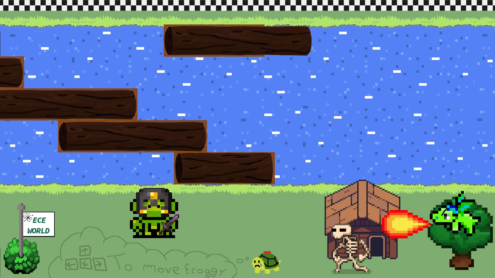

<script type="module">
  import mermaid from 'https://cdn.jsdelivr.net/npm/mermaid@10/dist/mermaid.esm.min.mjs';
    mermaid.initialize({ 
        startOnLoad: true,
        theme: 'base',
    });
</script>

<!--
# Style lead only for this slide
_class: lead
_footer: Algorithmique Avancée et Bibliothèque Graphique - 2022-2023
-->


**ING1** Projet d'informatique


# ECE World

Equipe de choc

---

# Equipe chômeurs


                    Lola LE GALL | Baptiste CHESNOT | Robin QUERIAUX | Laouïg ELEOUET
---

# ECE World


## Thème

Nous avons décidé de choisir pour thème le Moyen-Âge et plus particulièrement les chevaliers. Notre carte est dans un style fantasy avec un choix de plusieurs personnage en accord avec celle-ci.

Ils y a de plus des petites références à des jeux que nous affectionons particulièrement en rapport avec ce thème.

---

# Carte `1/2`

*Réalisée par : **Baptiste**, **Robin**.*

Décrire ici les fonctionnalités implémentées : choix joueurs, saisie des noms, affichage des scores/classement... Comment avez-vous fait ? Quels étaient les problèmes rencontrés.

---

# Carte `2/2`

Suite si ça ne tient pas sur une slide. 

:bulb: *Vous pouvez faire comme ça à chaque fois qu'une slide ne suffit pas, il vaut mieux 5 slides légères qu'une surchargée.*

---

# Organisation des jeux

- Les jeux sont classés de façon méthodique dans le Git avec un fichier pour chaque jeu, où fonctionnalité (Gestion des joueurs, musiques ou parc).

- Chaque dossier de jeu a son propre répertoire d'image afin de ne pas les mélanger pour tous les jeux et avoir une meilleur visibilité.

Quels paramètres prennent les jeux ?  La file d'événement par exemple ? Ou est-ce que chaque jeu crée sa propre file ?

Comment on lance un jeu et comment on revient à la carte à la fin de la partie ?
Comment le classement est-il mis à jour ?
- On va pouvoir accéder aux jeux en y aller physiquement sur la carte à l'aide du personnage mis à disposition.
- A la fin de chaque partie de mini-jeu, on appuie sur le bouton indiqué à l'écran afin de revenir dans le parc et de choisir un nouveau mini-jeu.

---


# Pêche aux canards

*Réalisé par : **Lola** (100%).*

Décrire le fonctionnement du jeu dans les grandes lignes. Comment vous l'avez conçu.
- Les canards vont de la droite à la gauche.
- Lorsqu'ils ont disparu, ils ont 1 chance sur 50 de réapparaitre à droite.
- Les canards vont à une vitesse différente (tirée aléatoirement).
- La collision des canards est détectée.
- etc.

Pour chaque jeu (bien détailler au moins un jeu par personne), précisez les structures de données (structures importantes, tableaux importants, listes chainées...) et les fonctions importantes (avec leur prototype).

### Structures

<div class="mermaid">
%%{init: {'theme':'neutral'}}%%
classDiagram
    class Canard
    Canard : int x, y
    Canard : int vitesse
    class Canne
    Canne : int x, y
    Canne : Canard* canard
</div>

### Tableaux

- `Canard canards[20]`
### Graphe d'appel
---
---
# Jackpot
*Réalisé par : **Lola** (100%).*


---
---
# Shoot au ballons
*Réalisé par : **Laouïg** (100%).*


---
---
# Rivière de la Tortue
*Réalisé par : **Laouïg** (100%).*



---
---
# Snake
*Réalisé par : **Robin** (100%).*


---
---
# Tappe Taupe
*Réalisé par : **Robin** (100%).*


---
---
# Héros de la guitare
*Réalisé par : **Baptiste** (100%).*


---
---
# Course de chevaux
*Réalisé par : **Baptiste** (100%).*


---
### Logigramme

Que vous jugez pertinent (image ou Mermaid.js)


---

# Bilan collectif
`Comment le travail a-t-il été réparti et qui s'est occupé de quelle fonctionnalité ?`
---
---
# Robin

## Tâches réalisées (pour chaque membre de l'équipe)

- `✅ 100%` Snake
- `✅ 100%` Tape-Taupe
- `✅ 100%` Système de gestion de point (structure)
- `✅ 100%` Système de sauvegarde du jeu en cours
    - *Développer ici pourquoi cette tâche n'est pas terminée à 100%. (exemple : on aurait pu améliorer...).*
- `❌ 20%` Tâche 3


---

# Laouïg

## Tâches réalisées (pour chaque membre de l'équipe)

- `✅ 100%` Traversée de la rivière
- `✅ 100%` Tir aux ballons
- `✅ 100%` Présentation MARP
  - *Développer ici pourquoi cette tâche n'est pas terminée à 100%. (exemple : on aurait pu améliorer...).*
- `❌ 20%` Tâche 3
---

# Lola

## Tâches réalisées (pour chaque membre de l'équipe)

- `✅ 100%` Pêche aux canards
- `✅ 100%` Jackpot
  - *Développer ici pourquoi cette tâche n'est pas terminée à 100%. (exemple : on aurait pu améliorer...).*
- `❌ 20%` Tâche 3
---
---

# Baptiste

## Tâches réalisées (pour chaque membre de l'équipe)

- `✅ 100%` Snake
- `✅ 100%` Tape-Taupe
- `✅ 100%` Création et gestion du parc
  - *Développer ici pourquoi cette tâche n'est pas terminée à 100%. (exemple : on aurait pu améliorer...).*
- `❌ 20%` Tâche 3
---
# Investissement

Si vous deviez vous répartir des points, comment feriez-vous ?
Dans notre second et dernier projet d'informatique de cette première année d'ingénieur, le travail a été assez bien répartie pour ce qui est des jeux (chacun d'entre nous en a réalisé 2).
Cependant pour ce qui est de la partie parc et gestion global, Robin et Baptiste y on passé le plus de temps. Cela pris en compte nous attribuerons donc aux membres du groupe les notes sur 20 de :
- `Lola`
- `Baptiste`
- `Robin`
- `Laouïg`
---

# Récapitulatif des jeux

| Jeu                 | Avancement | Problèmes / reste |
|---------------------|------------|-------------------|
| Jackpot             | 100%       | -                 |
| Pêche aux canards   | 100%       | -                 |
| Traversée rivière   | 95%        | -                 |
| Tir aux ballons     | 100%       | -                 |
| Héros de la guitare | 100%       | -                 |
| Course de chevaux   | 100%       | -                 |
| Snake               | 100%       | -                 |
| Tape-Taupes         | 100%       | -                 |

---


# Schémas et Graphes

Vous pouvez utiliser [Mermaid.js](https://mermaid.js.org/) pour générer des schémas. Regardez la documentation.

---

# Slide avec du code


```C
for(int i = 0; i < 5; i++) {
    printf("%d ", i);
}
```

> 0 1 2 3 4 


---

# Emojis

https://gist.github.com/rxaviers/7360908


# Export PDF

Depuis récemment, l'export (**`Export Slide Deck...`**) en PDF oublie parfois des éléments. 
Si c'est le cas, nous vous conseillons d'exporter en fichier PowerPoint (pptx), puis de l'exporter en PDF depuis PowerPoint.